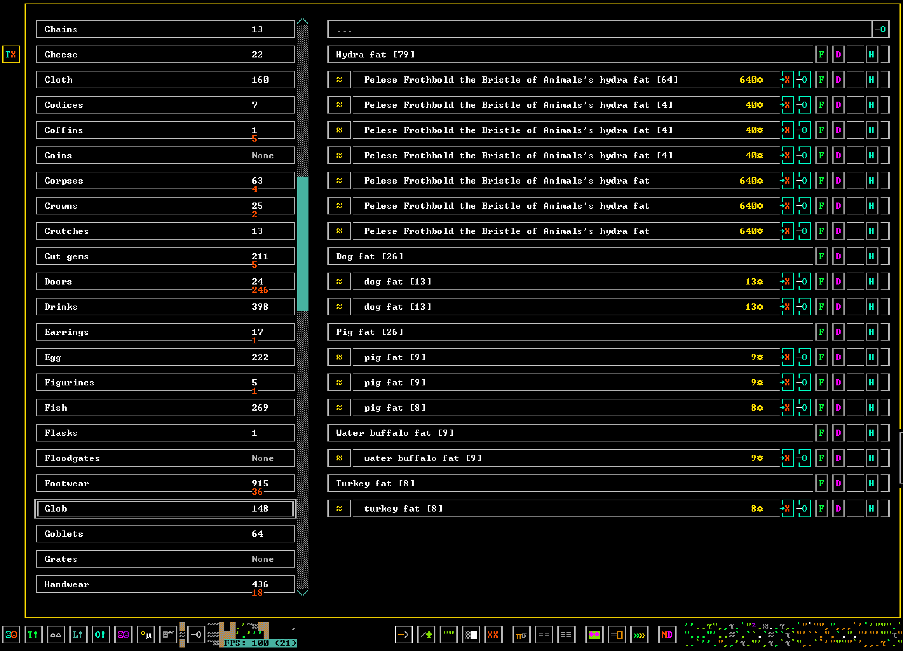
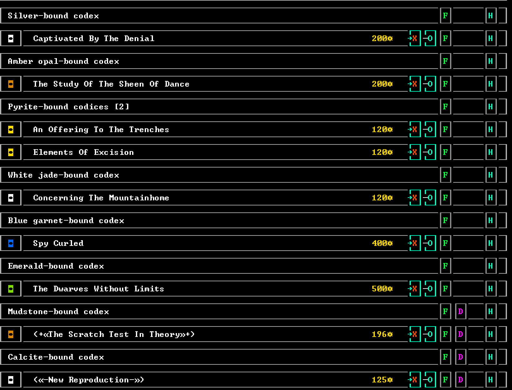

# df-stock-value

DFHack overlay for Dwarf Fortress 53.12 that displays exact item values inline on the vanilla Stocks screen.





## Requirements

- Dwarf Fortress 53.12
- DFHack 53.12-r1 or compatible

This is a DFHack script. It does not modify save data, and it does not replace the Stocks UI.

## Find your DFHack folder

Install the script into the Dwarf Fortress folder that contains DFHack's `hack/` directory.

Common locations:

- Windows, Steam:
  `C:\Program Files (x86)\Steam\steamapps\common\Dwarf Fortress`
- Windows, standalone/zip/Itch:
  the folder you extracted or installed Dwarf Fortress into, for example `C:\Games\df_53_12_win`
- Linux, Steam:
  `~/.local/share/Steam/steamapps/common/Dwarf Fortress`
- Linux, standalone/zip/Itch:
  the folder you extracted Dwarf Fortress into
- macOS via Sikarugir/Wine:
  the Wine prefix's Dwarf Fortress folder, for example `.../dwarf-fortress-classic.app/Contents/SharedSupport/prefix/drive_c/Games/df_53_12_win`

If the folder has `Dwarf Fortress.exe` or `Dwarf_Fortress` and also has a `hack/` subdirectory, it is the right folder.

## Install from a Download

Download or clone this repository, then copy:

```text
hack/scripts/stock-value.lua
```

from this repository into:

```text
<your Dwarf Fortress folder>/hack/scripts/stock-value.lua
```

Windows PowerShell example:

```powershell
Copy-Item .\hack\scripts\stock-value.lua "C:\Program Files (x86)\Steam\steamapps\common\Dwarf Fortress\hack\scripts\stock-value.lua"
```

Windows standalone example:

```powershell
Copy-Item .\hack\scripts\stock-value.lua "C:\Games\df_53_12_win\hack\scripts\stock-value.lua"
```

Linux example:

```sh
cp hack/scripts/stock-value.lua "$HOME/.local/share/Steam/steamapps/common/Dwarf Fortress/hack/scripts/stock-value.lua"
```

Generic example:

```sh
cp hack/scripts/stock-value.lua "/path/to/Dwarf Fortress/hack/scripts/stock-value.lua"
```

## Enable

In the DFHack console, run these as separate commands:

```lua
lua "require('plugins.overlay').rescan()"
```

```lua
overlay enable stock-value.values
```

If you are updating an already-loaded copy, use:

```lua
overlay disable stock-value.values
```

```lua
lua "package.loaded['stock-value']=nil; package.loaded['scripts.stock-value']=nil; require('plugins.overlay').rescan()"
```

```lua
overlay enable stock-value.values
```

## Use

Open the vanilla Stocks screen. Expanded item rows show their exact item value in yellow near the row action buttons.

Group/header rows are intentionally skipped.

## Update

Replace the installed file with the new version:

```text
<your Dwarf Fortress folder>/hack/scripts/stock-value.lua
```

Then run the update commands from the Enable section.

## Uninstall

In the DFHack console:

```lua
overlay disable stock-value.values
```

Then delete:

```text
<your Dwarf Fortress folder>/hack/scripts/stock-value.lua
```

## Compatibility Notes

- Requires DFHack. This is not a vanilla Dwarf Fortress raw mod.
- Tested against Dwarf Fortress 53.12 with DFHack 53.12-r1.
- Should work on Windows and Linux when installed into the matching DFHack `hack/scripts/` folder.
- macOS works when running the Windows version through Sikarugir/Wine, as long as DFHack is installed and working there.
- The overlay reads visible Stocks rows and maps them back to DF item objects so duplicate names can show different values.

## Limitations

- The vanilla Stocks screen does not expose visible row-to-item mapping to Lua, so this overlay reconstructs that mapping from the rendered Stocks list and DFHack item data.
- It may need updates if future Dwarf Fortress or DFHack versions change the Stocks screen layout or internal stock list fields.
- If a row is misdetected, the overlay should only draw an incorrect value; it does not modify item data or save data.
